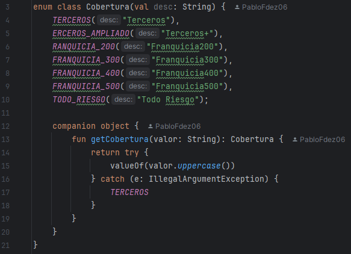
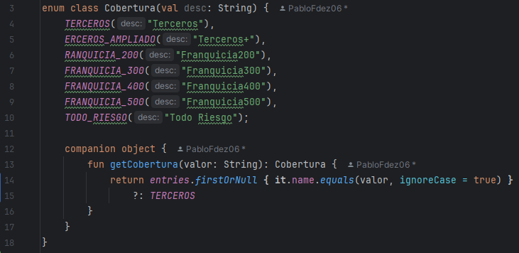

# 
EDE_CodeSmell_PFF

# COMO ANALIZAR EL CÓDIGO

1. Seleccionamos Codigo/Code - Analizar Codigo/Analyze Code | Esto te generara un informe de errores, posibles mejoras, etc.
2. Una vez nos haya generado este informe, podremos exportarlo como HTML, o visualizarlo en el mismo IDE.

# DETECCIÓN DE 5 ERRORES

### 1. Código Duplicado en ConfiguracionesApp
  
- **Ubicación:** Clase ConfiguracionesApp.kt, líneas 82-88, 115-121, 139-145.
- **Tipo:** Duplicate Code (Código Duplicado).
- **Descripción:** Fragmentos de código similares aparecen repetidamente en la misma clase, lo que incrementa el riesgo de errores al mantener el código.
- **Solución sugerida:** Extraer los fragmentos repetidos a un método común reutilizable.

### 2. Método que Siempre Retorna el Mismo Valor
  
- **Ubicación:** Interfaz IRepoUsuarios, método cambiarClave.
- **Tipo: Redundancia Declarativa.**
- **Descripción:** Todas las implementaciones del método siempre retornan true, lo cual hace innecesario su retorno como valor dinámico.
- **Solución sugerida:** Revisar si el valor de retorno es necesario. Si no lo es, cambiar el tipo de retorno a void.

### 3. Propiedad Privado No Utilizado
   
- **Ubicación:** Enum Cobertura, método getCobertura(valor: String).
- **Tipo:** Control de flujo inapropiado / Código frágil basado en excepciones.
- **Descripción:** El método getCobertura usaba una llamada a valueOf(valor.uppercase()) seguida de un bloque try-catch para manejar posibles errores de entrada. Esta forma de control de flujo mediante excepciones es enrevesada y poco clara. Además, se fijaba el comportamiento a los nombres exactos del enum, lo que puede fallar con entradas incorrectas.
- **Solución sugerida:** Eliminar si no se planea utilizar, o documentar explícitamente su propósito si es para uso futuro.

### 4. Declaraciones Redundantes No Utilizadas
   
- **Ubicación:** Clase Main.kt, método main().
- **Tipo:** Entry Point sin lógica o Código Inerte.
- **Descripción:** El método main() existe, pero no contiene ninguna lógica significativa ni es utilizado como punto de entrada real.
- **Solución sugerida:** Eliminar o implementar si se prevé como punto de inicio.

### 5. Método que siempre retorna el mismo valor

- **Ubicación:** Interfaz IRepoUsuarios, método cambiarClave().
- **Tipo: Código Inflado** / Interfaz Mal Diseñada.
- **Descripción:** Todas las implementaciones del método cambiarClave() retornan siempre true, lo que sugiere que el método no aporta lógica significativa ni diferenciación funcional. Esto rompe principios como Tell, Don’t Ask y podría reflejar una mala definición de responsabilidades o un diseño superficial.
- **Solución sugerida:**
  
    - Eliminar el método si no tiene utilidad real.
    - Refactorizar para que implemente lógica concreta (validaciones, persistencia, etc.).
    - Considerar retornar un objeto de resultado (como un Result, Either, o lanzar excepciones controladas) para representar correctamente el resultado de la operación.

# USO DE REFACTORIZACIÓN

1. ENUM CLASS COBERTURA

**ANTES**

**DESPUES**

# RESPUESTA A LAS PREGUNTAS

[1]

[2]

[3]
