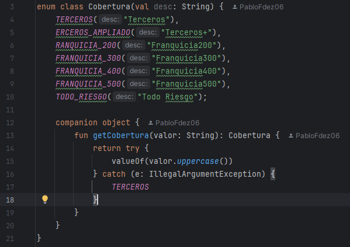

# <p align="center">EDE_Linting_PFF</p>


# INSTALACIÓN DETEKT

1. Agrega Detekt al archivo build.gradle.kts
 ```
  plugins {
    id("io.gitlab.arturbosch.detekt") version "1.23.1"
  }

 ```
2. Sincronizamos el proyecto con Gradlew
3. Generamos el archivo de configuración: ```./gradlew detektGenerateConfig```. Lo que crea un archivo detekt.yml en la raíz o dentro de /config/detekt/.



# EJECUCIÓN DEL ANALISIS

- ``` ./gradlew detekt```

### RESULTADOS:

[Datos del Análisis](./build/reports/detekt/detekt.html)

# DETECCIÓN DE 5 ERRORES


### 1. Código Duplicado en ConfiguracionesApp
  
- **Ubicación:** Clase ConfiguracionesApp.kt, líneas 82-88, 115-121, 139-145.
- **Tipo:** Duplicate Code (Código Duplicado).
- **Descripción:** Fragmentos de código similares aparecen repetidamente en la misma clase, lo que incrementa el riesgo de errores al mantener el código.
- **Solución sugerida:** Extraer los fragmentos repetidos a un método común reutilizable.

### 2. Método que Siempre Retorna el Mismo Valor
  
- **Ubicación:** Interfaz IRepoUsuarios, método cambiarClave.
- **Tipo: Redundancia Declarativa.**
- **Descripción:** Todas las implementaciones del método siempre retornan true, lo cual hace innecesario su retorno como valor dinámico.
- **Solución sugerida:** Revisar si el valor de retorno es necesario. Si no lo es, cambiar el tipo de retorno a void.

### 3. Constructor Privado No Utilizado
   
- **Ubicación:** Enum Cobertura, constructor Cobertura(String desc).
- **Tipo:** Dead Code / Código Inalcanzable.
- **Descripción:** El constructor privado no es invocado en ningún lugar del código, indicando que está presente sin una función real.
- **Solución sugerida:** Eliminar si no se planea utilizar, o documentar explícitamente su propósito si es para uso futuro.

### 4. Declaraciones Redundantes No Utilizadas
   
- **Ubicación:** Clase Main.kt, método main().
- **Tipo:** Entry Point sin lógica o Código Inerte.
- **Descripción:** El método main() existe, pero no contiene ninguna lógica significativa ni es utilizado como punto de entrada real.
- **Solución sugerida:** Eliminar o implementar si se prevé como punto de inicio.

### 5. Método que siempre retorna el mismo valor

- **Ubicación:** Interfaz IRepoUsuarios, método cambiarClave().
- **Tipo: Código Inflado** / Interfaz Mal Diseñada.
- **Descripción:** Todas las implementaciones del método cambiarClave() retornan siempre true, lo que sugiere que el método no aporta lógica significativa ni diferenciación funcional. Esto rompe principios como Tell, Don’t Ask y podría reflejar una mala definición de responsabilidades o un diseño superficial.
- **Solución sugerida:**
  
    - Eliminar el método si no tiene utilidad real.
    - Refactorizar para que implemente lógica concreta (validaciones, persistencia, etc.).
    - Considerar retornar un objeto de resultado (como un Result, Either, o lanzar excepciones controladas) para representar correctamente el resultado de la operación.

# USO DE REFACTORIZACIÓN

# RESPUESTA A LAS PREGUNTAS

[1]

[2]

[3]
